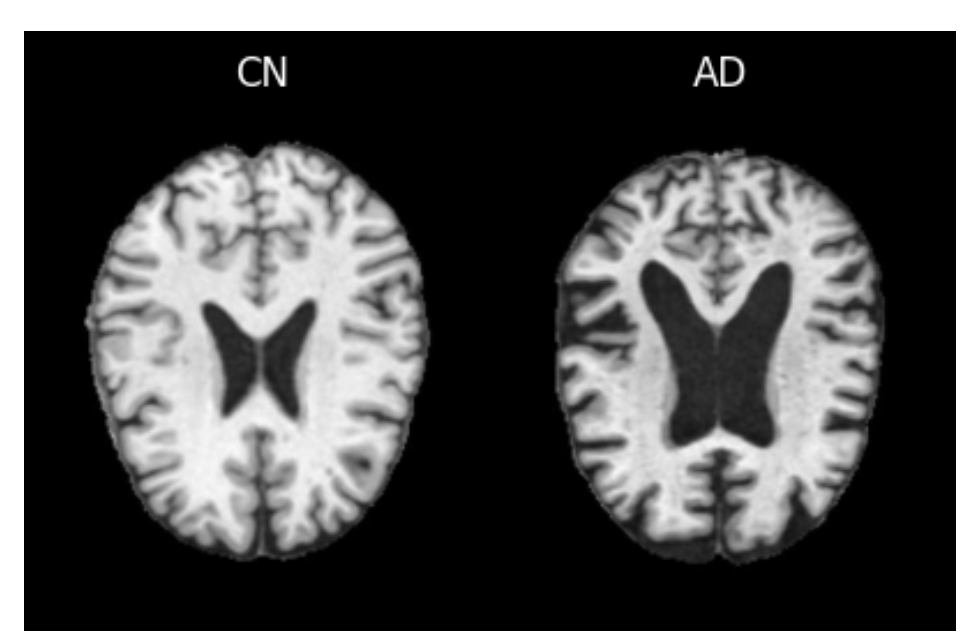
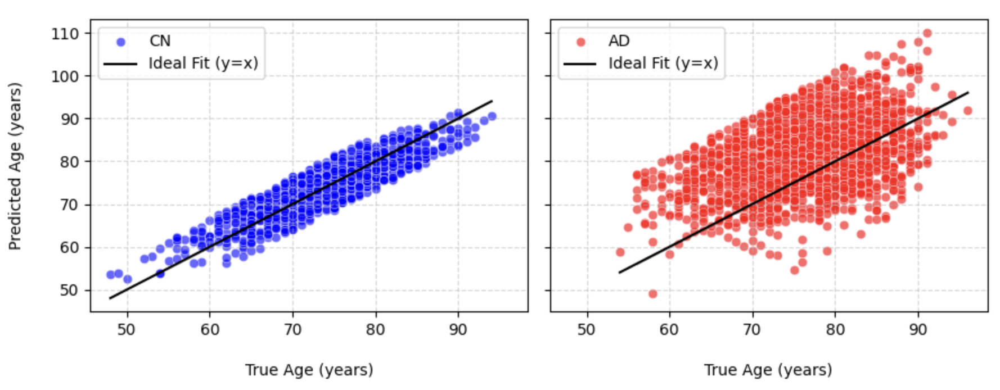

# MRI BrainAge

This project was developed as part of the Fundamentals of Data Analysis course examination. Inspired by the groundbreaking paper titled "**[Accurate brain‐age models for routine clinical MRI examinations](https://www.sciencedirect.com/science/article/pii/S1053811922000015?via%3Dihub)**", the work focuses on creating a predictive model using volumetric features extracted via **SynthSeg (FreeSurfer)** from **3D T1-w brain MRIs**. It estimates brain age, detecting deviations between chronological and biological brain age, showing that Alzheimer’s Disease links to accelerated brain ageing.

Using datasets from **ADNI**, **AIBL**, and **OASIS**, I curated a collection of **7545 MRI scans** from **2227 unique patients** for analysis. These scans belong exclusively to two diagnostic categories:
* Cognitively Normal `CN` **68.68%**
* Alzheimer's Disease `AD` **31.32%**

   

## Linking Brain Age and Alzheimer’s

A polynomial regression model was trained via **Cross-Validation**, achieving a **MAE of 3.98 years**, with age as the dependent variable and other features as predictors. Trained on CN data, it predicted brain age for CN patients, with a Brain PAD of **-0.12 years**, closely matching chronological age. For AD patients, however, it showed a Brain PAD of **+7.48 years**, indicating that AD’s association with accelerated brain ageing.

   

