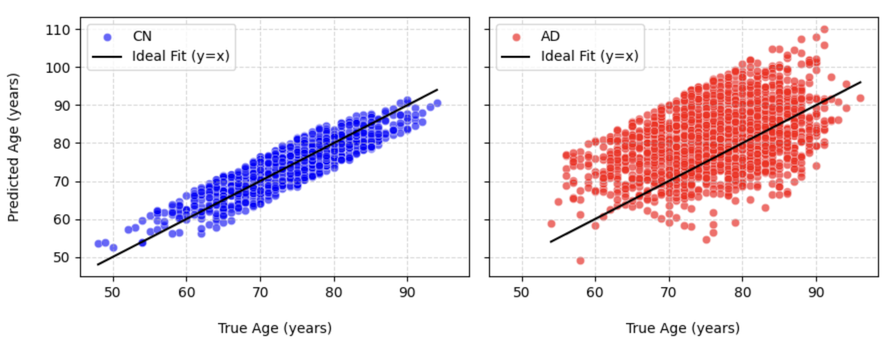

   
   
   
   

 

This project was developed as part of the Fundamentals of Data Analysis course examination. Inspired by the groundbreaking paper titled "**[Accurate brain‐age models for routine clinical MRI examinations](https://www.sciencedirect.com/science/article/pii/S1053811922000015?via%3Dihub)**", the work focuses on creating a predictive model using volumetric features extracted via **SynthSeg (FreeSurfer)** from **3D T1w Brain MRIs**. It estimates brain age, detecting deviations between chronological and biological brain age, showing that **Alzheimer’s Disease (AD)** links to accelerated brain ageing.

## Linking Brain Age and Alzheimer’s Disease

A polynomial regression model was trained via Cross-Validation, achieving a **MAE of 4.42 years**, with age as the dependent variable and other features as predictors. Trained on CN data, it predicted brain age for CN patients, with a Brain PAD of **-0.7 years**, closely matching chronological age. For AD patients, however, it showed a Brain PAD of **+5.32 years**, indicating that AD’s association with accelerated brain ageing.

   

